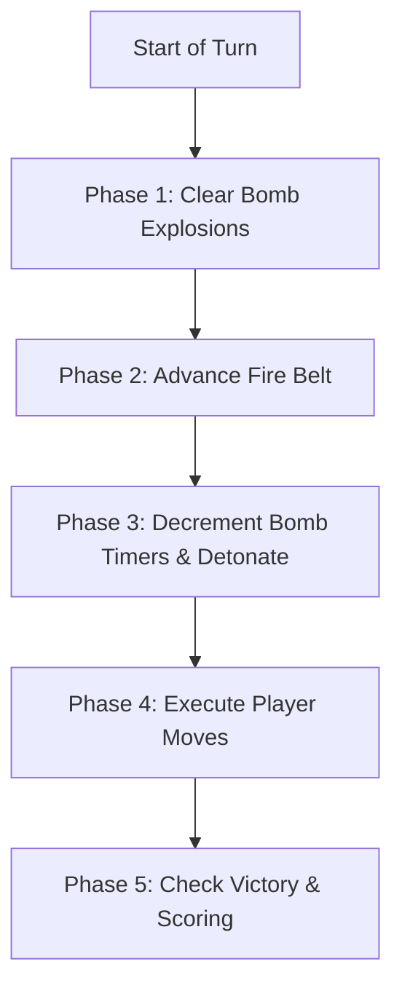

# Bomberninja: Definitive Tournament & Engine Rules Specification

> [!IMPORTANT]
> This document specifies the **exact rules, data structures, and engine mechanics** reverse-engineered directly from the official **01-Edu Tournament Platform** (`tournament.01edu.ai` / `beta.tournament.01edu.ai`) server code (`games/bomberninja/server.js`).
>
> Adhering strictly to these rules is mandatory: **a single violation will result in instant disqualification and death.**

---

## 1. Executive Summary & Architecture

- **Platform:** 01-Edu Tournament Platform.
- **Match Setup:** 2 to 4 bots compete simultaneously on a shared 20×20 grid.
- **Max Turns:** **350 turns**.
- **Execution Mode:** Web Workers / Asynchronous event loop.
- **Time Limit:** **250 milliseconds per turn** enforced by `Dr(worker, 250)`.
- **Winning Condition:** Last surviving player, or highest score upon reaching turn 350.

---

## 2. Critical Rules That Must NEVER Be Broken

The game server enforces strict disqualification checks in `applyMove()`. If violated, the server calls:
```javascript
M({ data: `move: ${p} is invalid ` }, n);
// which executes:
a.players[n].isDead = currentTurn; // INSTANT DEATH
```

### Rule 1: The 250ms Per-Turn Time Limit
- The runner waits a maximum of **250ms** for your tactic function to return a move.
- If your function exceeds 250ms, a timeout error is triggered: `{ type: 1, data: "timed out" }`.
- Receiving this object marks your bot dead immediately.
- **Best Practice:** Keep pathfinding and logic under **5ms** average.

### Rule 2: Legal Move Return Values
Your tactic function must return **strictly a single integer**:
| Return Value | Meaning | Condition |
| :--- | :--- | :--- |
| `-1` | `Move.PLACE_BOMB` | Drops bomb on current tile. Only valid if `board[myPos] === 0` and current active bombs < bomb limit. |
| `0` or `myPos` | `Move.STAY` | Bot stays on current tile. |
| `myPos - 20` | Up | Valid only if inside board, not on row 0, and target is walkable. |
| `myPos + 20` | Down | Valid only if inside board, not on row 19, and target is walkable. |
| `myPos - 1` | Left | Valid only if not crossing row boundary (`col > 0`), and target is walkable. |
| `myPos + 1` | Right | Valid only if not crossing row boundary (`col < 19`), and target is walkable. |

**FATAL VIOLATIONS (Result in Instant Disqualification):**
- Returning strings (e.g. `"UP"`, `"LEFT"`), arrays, objects, `null`, or `undefined`.
- Moving diagonally (e.g. `myPos + 21`).
- Moving more than 1 tile in a single turn.
- Horizontal row-wrapping (e.g. moving from index 19 to 20 or from 20 to 19).
- Indices outside `0..399`.

### Rule 3: Obstacle Collision
Moving into any of the following tiles is **illegal and results in instant death**:
- **Wall (`2`)**: Indestructible barrier.
- **Brick (`1`)**: Destructible obstacle (must be destroyed by bomb first).
- **Bomb (`4`)**: You cannot walk onto a bomb tile (exception: if another player dropped a bomb on that tile during the current turn).

### Rule 4: Exception Handling
- If your bot code throws an uncaught JavaScript error (e.g., `TypeError`, `RangeError`), the web worker catches it and transmits `{ type: 1, data: error.message }` to the server.
- The server records a disqualification and sets `isDead = currentTurn`.
- **Failsafe:** Always wrap your turn logic in a `try { ... } catch (err) { return Move.STAY; }` block.

---

## 3. Data Layout & Board Representation

The board is a 1D linear array of 400 elements representing a 20×20 grid:
$$\text{index} = \text{row} \times 20 + \text{col}$$
$$\text{row} = \lfloor\text{index} / 20\rfloor, \quad \text{col} = \text{index} \bmod 20$$

### Cell Values (`Cell` Enum):
| Value | Constant | Symbol | Description | Walkable? |
| :---: | :--- | :---: | :--- | :---: |
| `0` | `Cell.EMPTY` | ` ` | Open walkable tile. | **Yes** |
| `1` | `Cell.BRICK` | `░░` | Destructible brick. May conceal a power-up. | **No** |
| `2` | `Cell.WALL` | `██` | Indestructible outer wall or pillar. | **No** |
| `3` | `Cell.FREE` | `🟢` | Spawn safety buffer (converted to `0` at game start). | **Yes** |
| `4` | `Cell.BOMB` | `💣` | Active ticking bomb (fuse = 4 turns). | **No** |
| `5` | `Cell.EXPLOSION` | `💥` | Active explosion blast (1-turn hazard or fire belt). | **Yes (Takes Damage)** |
| `6` | `Cell.POWERUP_LIVE` | `❤️` | Adds +1 life to player upon pickup. | **Yes** |
| `7` | `Cell.POWERUP_BOMB` | `💣+` | Adds +1 max concurrent bomb capacity. | **Yes** |
| `8` | `Cell.POWERUP_POWER` | `🧨+` | Adds +1 bomb blast radius (tile reach). | **Yes** |

---

## 4. Tactic Function Signature & Inputs

### Initialization:
```javascript
export default (initialState, playerId) => {
  // Executed once when the game begins.
  // initialState contains full server state:
  // { board, powerUpCells, players: { [id]: { id, position, live, power, bombs, isDead } }, bombs: [] }

  return (state) => {
    // Executed every turn.
    // Must return an integer move (-1, 0, or adjacent cell index).
  };
};
```

### Turn State Input (`state`):
```typescript
interface TurnState {
  board: Uint8Array(400); // Current board state (0-8)
  players: {
    [playerId: string]: number; // Player ID mapped ONLY to current cell index!
  };
}
```
> [!WARNING]
> On each turn, `state.players[id]` is **purely the integer cell position**, NOT an object with `{ live, power, bombs }`.
> Dead players are omitted from `state.players`.

---

## 5. Detailed Turn Lifecycle (Engine Phases)

On every turn, `applyMove(moves)` runs the following sequence in exact order:



### Phase 1: Clear Bomb Explosions
- Any cell with `board[i] === 5` that is **not** part of the permanent fire belt is reset to `Cell.EMPTY` (`0`).
- Bomb explosions therefore last for **exactly 1 turn**.

### Phase 2: Advance Fire Belt (Sudden Death)
- Commences at turn index 99 (`turn + 1 === 100`).
- Advances every **3 turns** (`(turn + 1 - 100) % 3 === 0`).
- Progresses along a 4-sided inward spiral, placing permanent hazard cells.
- Affected cells are permanently added to hazard set `I` and assigned `board[cell] = 5`.
- Any player standing on these cells loses 1 life (`--live <= 0 ? isDead = turn : null`).

### Phase 3: Update Bombs & Detonations
- For all active bombs, `countdown--`.
- If `countdown <= 0`:
  1. Bomb is removed from active list.
  2. Blast rays are calculated in 4 directions (`up, down, left, right`) up to `bomb.power` cells:
     - **Wall (`2`)**: Blast is blocked immediately; wall is undamaged.
     - **Brick (`1`)**: Blast destroys brick (spawns hidden powerup if present, else empty); blast does not penetrate past the brick.
     - **Chain Reaction**: If another active bomb is in the blast radius, its countdown is immediately reduced to `1` (explodes next turn!).
     - **Damage**: All players caught in blast lose 1 life (`--live <= 0 ? isDead = turn : null`).
     - **Explosion Tile**: Empty and blast-penetrated tiles become `5` (`EXPLOSION`).

### Phase 4: Execute Player Moves
Moves are processed for each player in turn order:
1. If player `isDead`: skipped.
2. If move is error object: player is disqualified (`isDead = turn`).
3. If player is standing in fire belt set: takes 1 damage.
4. If move is `0` or `player.position`: player stays in place.
5. If move is `-1` (`PLACE_BOMB`):
   - Can only place if `board[myPos] === 0` and `activeBombs < player.bombs`.
   - Bomb placed with `countdown = 4`.
6. If move is adjacent index:
   - Validated against walls, bricks, bombs, bounds, and row wrapping.
   - If invalid: **disqualified**.
   - If valid: player moves to destination.
   - If destination is `5` (`EXPLOSION`): takes 1 damage.
   - If destination is power-up (`6`, `7`, `8`): stat incremented, tile becomes `0`.

### Phase 5: Check Victory
- If `turn >= 350`, or $\le 1$ player remains alive:
  - Game ends (`type: 3`).
  - Alive players receive score: `700` (`MAX_TURNS * 2`).
  - Dead players receive score equal to the turn they died (`isDead`).

---

## 6. Fire Belt Shrinking Algorithm

The fire belt begins advancing at turn 100 and advances every 3 turns:

$$\text{step} = \frac{\text{turn} + 1 - 100}{3}$$
$$e = 19, \quad \text{discriminant} = e^2 - 4 \times \text{step}$$
$$\text{level} = \lfloor\frac{e - \sqrt{\text{discriminant}}}{2}\rfloor, \quad \text{pos} = \text{step} - \text{level} \times (e - \text{level})$$

On each fire turn, 4 cells are ignited simultaneously (one on each of the 4 borders of the current concentric ring):
1. **Top border:** $(\text{level} + 1, \text{level} + 1 + \text{pos})$
2. **Right border:** $(\text{level} + 1 + \text{pos}, 19 - (\text{level} + 1))$
3. **Bottom border:** $(19 - (\text{level} + 1), 19 - (\text{level} + 1) - \text{pos})$
4. **Left border:** $(19 - (\text{level} + 1) - \text{pos}, \text{level} + 1)$

> [!CAUTION]
> Fire belt cells **never revert to 0**. They remain hazardous for the rest of the match. Always navigate toward the center ($9 \le \text{row} \le 10, 9 \le \text{col} \le 10$) well before turn 100!

---

## 7. Strategic Checklist for Your Tactic

- [x] **Never Return Illegal Indices**: Strictly return `-1`, `0`, or an adjacent orthogonal index.
- [x] **Always Verify Walkability**: Target tile must not be Wall (`2`), Brick (`1`), or Bomb (`4`).
- [x] **Check Row Wrapping**: When moving left or right, ensure $\lfloor\text{from} / 20\rfloor == \lfloor\text{to} / 20\rfloor$.
- [x] **Bomb Countdown Escape**: When placing a bomb, ensure a 3-step escape route exists outside the blast radius.
- [x] **Avoid Explosions (`5`)**: Never step onto a tile marked `5`.
- [x] **Track Fire Belt**: Retreat to the central quadrant before turn 95.
- [x] **Harvest Power-Ups**: Prioritize collecting ❤️ Lives (`6`), 💣 Bombs (`7`), and 🧨 Power (`8`).
- [x] **Wrap Everything in Try/Catch**: Prevent uncaught runtime exceptions from triggering disqualification.
